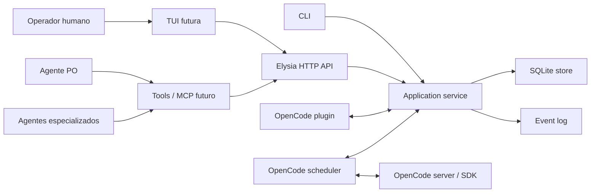
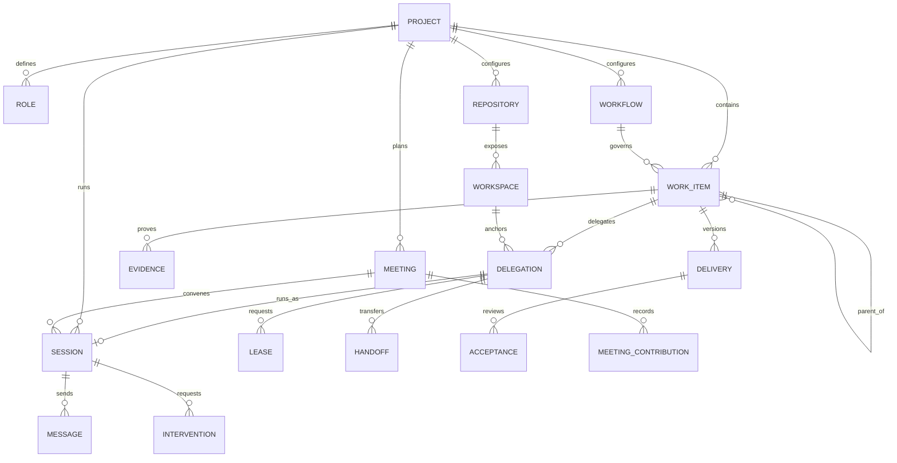
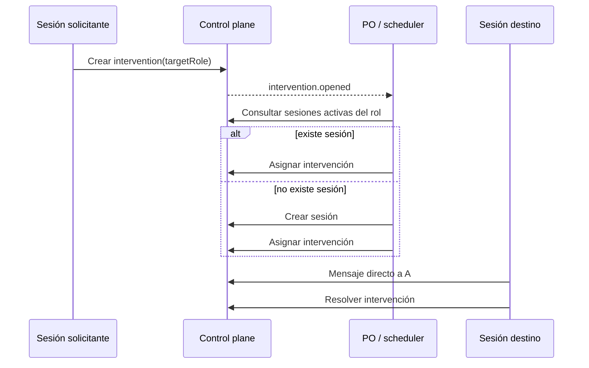

## 🎯 Objetivo

Linear Crew reemplaza el uso de GitLab como medio de coordinación entre agentes. Provee una fuente de verdad local, auditable y consultable para que un PO, agentes especializados y operadores humanos administren planeación, ejecución, comunicación e intervención sin triangular contexto mediante prompts.

---

## ✅ Goals

- Representar proyectos, roles y trabajo jerárquico (`milestone`, `epic`, `issue`, `task`).
- Representar topologías single-repo, monorepo y multi-repo sin dividir el grafo global de trabajo.
- Definir workflows por proyecto sin codificar procesos particulares en el core.
- Registrar sesiones de agentes independientemente del runtime que las ejecuta.
- Permitir mensajes entre sesiones y solicitudes de intervención dirigidas a humanos o roles.
- Anclar cada delegación a un outcome, revisión, workspace, rol y sesión durables.
- Proteger escrituras con leases transaccionales y fencing tokens por workspace.
- Representar handoffs reconocibles, evidencia y aceptación independiente como entidades.
- Mantener un event log inmutable para auditoría, reanudación y futuras actualizaciones en tiempo real.
- Exponer el mismo dominio mediante CLI, HTTP, plugin OpenCode y TUI.
- Ejecutarse exclusivamente en Bun 1.4 o superior.

---

## 🚫 Non-Goals

- Ser un framework Scrum ni imponer ceremonias, estados o roles predefinidos.
- Ejecutar agentes o administrar worktrees en el primer MVP.
- Reemplazar Git como sistema de control de versiones.
- Sincronizar bidireccionalmente con GitLab, Linear u otros trackers.
- Resolver automáticamente conflictos entre agentes.
- Implementar autenticación multiusuario o despliegue distribuido en el primer MVP.

---

## 🧠 Background

Usar `glab` convierte issues y comentarios remotos en un bus de coordinación accidental. El PO debe transferir información entre agentes, la comunicación depende de cierres de sesión y la semántica del proceso queda atada al tracker. Herramientas como Ralph TUI validan el valor de una interfaz terminal y ejecución paralela, pero su unidad principal es un loop de implementación. Linear Crew necesita que la unidad principal sea el control plane persistente: actores, trabajo, sesiones, señales y eventos.

---

## 🔄 Dependencias y prerrequisitos

- Bun 1.4+ como runtime, test runner y proveedor de SQLite.
- Elysia 2 para el adaptador HTTP.
- Bunli para la interfaz de línea de comandos.
- SQLite local como almacenamiento del MVP.
- OpenTUI sobre Bun para el dashboard humano.
- `@opencode-ai/plugin` para tools y hooks del runtime actual.

No se permiten APIs de compatibilidad `node:*` en código del producto.

---

## 🧭 Overview general

El dominio no conoce Elysia, Bunli, OpenCode ni OpenTUI. Todos son adaptadores sobre el mismo application service.

La regla de consistencia central es: cada responsabilidad se liga a un outcome y revisión concretos; cada ejecución a una sesión y workspace; cada escritura a un lease vigente; cada transferencia a un handoff reconocido; y cada cierre a una aceptación independiente sobre evidencia inmutable.

---

## ⚙️ Diseño Detallado

### Componentes clave

- `ControlPlane`: aplica invariantes, crea entidades, avanza workflows y emite eventos.
- `SqliteStore`: persiste documentos versionables y un event log ordenado.
- `createHttpApp`: traduce HTTP a comandos del application service.
- CLI Bunli: permite operar localmente sin levantar el servidor.
- Plugin OpenCode: registra tools estructuradas, enlaza el `sessionID` real e inyecta contexto durable durante compactación.
- Guía autodocumentada: `projectGuide` proyecta configuración, invariantes, capacidades y el flujo de implementación para agentes y humanos.
- Dashboard OpenTUI: monitorea proyecciones y eventos, y permite publicar contexto humano dirigido.
- `OpenCodeScheduler`: crea sesiones primarias con un `directory` por context root, ejecuta reuniones multirol, envía prompts asíncronos, reconcilia estado y despierta coordinadores.
- Runtime administrado: inicia un servidor OpenCode mediante el SDK, ejecuta el scheduler y garantiza su cierre coordinado.
- Distribución Bun: el build produce bundles ESM con `target: "bun"`; `dist/cli.js` es el bin enlazable y `dist/opencode-plugin.js` implementa los exports raíz, `./plugin` y `./server` del paquete.

### Modelo de dominio

Un `Workflow` del MVP contiene una lista ordenada de etapas. Cada etapa declara una clave, nombre y rol responsable. Al avanzar un work item, el control plane cambia a la siguiente etapa y emite un evento; no decide cómo se ejecuta esa etapa. Rechazo, bloqueo y handoff son transiciones explícitas fuera de la secuencia feliz. La evolución prevista reemplaza la lista por transiciones nombradas con guards cuando aparezcan casos reales de bifurcación o join; no se implementará un motor DAG general antes de necesitarlos.

### Comunicación e intervención

El MVP registra la solicitud, su asignación a una sesión, los mensajes y la resolución. El plugin y scheduler operan estas transiciones, crean sesiones OpenCode en el workspace correcto y despiertan al destinatario sin relay del PO.

### Reuniones de planificación

Una `PlanningMeeting` conserva objetivo, facilitador, participantes por rol y workspace, ronda actual y estado. El scheduler abre una sesión OpenCode raíz y de solo lectura por participante. Cada participante registra una sola `MeetingContribution` por ronda; la siguiente ronda recibe el transcript de la anterior para crítica cruzada. Tras la última ronda, el facilitador sintetiza decisiones, preguntas abiertas, milestones, epics, issues, ownership y acceptance gates. Las notas humanas dirigidas a la reunión se persisten y se entregan a todos los participantes activos.

### Contexto curado

El event log y las entidades operativas no son el prompt de producto. `contextForSession` construye una proyección acotada a la delegación o reunión actual, sus work items y ancestros, sesiones coordinadas, handoffs pendientes, intervenciones relevantes y síntesis recientes. Solo inyecta las 20 notas y mensajes relevantes más recientes e informa el conteo omitido. El agente consulta historia paginada con `crew_context_history` o telemetría con `crew_operational_context` únicamente cuando la tarea lo requiere.

Las notas humanas admiten las categorías `context`, `decision` y `constraint`. Leases, estados de sesión, reintentos y fallos de runtime viven como entidades o eventos operativos, nunca como comentarios mezclados con decisiones del producto.

### Persistencia

SQLite usa dos tablas:

- `entities`: proyección actual, discriminada por `kind`, con payload JSON y timestamps.
- `events`: secuencia append-only con tipo, agregado, actor y payload JSON.

Cada mutación escribe proyección y evento en una misma transacción. Este esquema minimiza migraciones durante el descubrimiento del dominio; cuando los patrones de consulta se estabilicen, las proyecciones de alto volumen podrán normalizarse.

---

## 🛠 Arquitectura de Extensibilidad

- Los workflows son datos configurables, no clases ni ramas condicionales.
- Los runtimes de agentes implementarán un puerto común y traducirán eventos externos a comandos del dominio.
- HTTP, CLI, MCP y TUI son adaptadores reemplazables.
- Nuevas vistas se construyen consumiendo `events` y entidades sin alterar la escritura del dominio.

---

## 🧩 Decisiones de Diseño y Trade-offs

- **Control plane local primero**: reduce operación y habilita uso offline; no ofrece coordinación entre hosts en el MVP.
- **SQLite sobre JSON files**: aporta transacciones, concurrencia y consultas sin introducir un servicio externo.
- **Event log más proyección actual**: facilita auditoría y UI reactiva sin imponer event sourcing completo.
- **Workflows como etapas ordenadas en el MVP**: cubre los flujos iniciales y evita construir prematuramente un motor DAG; dependencias y guards serán entidades explícitas, no convenciones en prompts.
- **Sesión separada de rol**: varias sesiones pueden representar el mismo rol y una sesión concreta puede recibir mensajes.
- **Intervención como entidad explícita**: una duda no obliga a terminar la sesión y puede tener ciclo de vida, responsable y resolución.
- **Leases por workspace, no por perfil**: dos roles no pueden escribir simultáneamente sobre el mismo checkout compartido; análisis de sólo lectura no requiere lease.
- **Coordinador durable**: una sesión puede adoptarse de forma auditada por un nuevo coordinador y no queda ligada al ID efímero del PO que la inició.
- **Aceptación sobre delivery revision**: QA acepta o rechaza una revisión y evidencia concretas, nunca el estado actual ambiguo de una issue.
- **Plugin sin lógica de dominio**: OpenCode aporta identidad y ciclo conversacional, pero todas las invariantes permanecen en `ControlPlane`.
- **TUI como proyección**: OpenTUI consume snapshots y eventos y publica comandos del dominio; no mantiene una segunda fuente de verdad.
- **Un proyecto, múltiples fronteras**: repositorios y context roots no crean proyectos Linear Crew separados. Outcomes, dependencias y decisiones permanecen globales.
- **Sesiones por context root**: el scheduler siempre crea sesiones raíz sin `parentID` y usa el subdirectorio exacto para activar contexto local.
- **Reunión como agregado durable**: sus rondas y contribuciones sobreviven al proceso y no dependen del transcript de una sola sesión.
- **Participantes de solo lectura**: una sesión de reunión no puede modificar archivos; la implementación posterior requiere una delegación independiente y su lease.
- **Servidor administrado opcional**: `runtime` es dueño de `createOpencodeServer`, usa su URL para el scheduler y llama `close()` al terminar; `scheduler` permanece disponible para servidores externos.
- **Configuración local por defecto**: `runtime` resuelve proyecto, database, root, hostname y port desde `.linear-crew.json`; los flags son overrides y no requisitos.
- **Seguridad del servidor**: loopback puede operar sin contraseña y el warning de OpenCode es informativo. Un bind no-loopback requiere `OPENCODE_SERVER_PASSWORD`; plugin y scheduler reutilizan esas credenciales mediante Basic Auth.
- **Bundle Bun sin ejecutable nativo**: el CLI conserva un shebang Bun y se distribuye como JavaScript mediante `package.json#bin`; no se usa `--compile` para evitar políticas de autorización de binarios.
- **Contexto de producto separado de operaciones**: el prompt por defecto excluye telemetría, historial no relacionado y entidades cerradas; las vistas completas son consultas explícitas y paginadas.
- **Topología estática local, estado dinámico en SQLite**: `.linear-crew.json` declara modo, root y context roots; sesiones, leases y trabajo viven en la base.

---

## 📌 Consideraciones

- El MVP asume un único proceso escritor; SQLite soporta lectores concurrentes, pero el scheduler distribuido requerirá leasing.
- No existe autenticación. La API debe escuchar en loopback por defecto.
- Los payloads JSON necesitan versionado antes de introducir migraciones incompatibles.
- Los mensajes almacenan contexto, no transcript completo del proveedor de IA.
- La vista curada limita notas y mensajes recientes a 20; conserva conteos omitidos y acceso paginado para evitar pérdida de auditabilidad.
- La TUI debe derivar su estado de snapshots más eventos para recuperarse de desconexiones.
- Los estados desconocidos de un runtime se conservan como desconocidos; nunca equivalen a `idle`.
- `Role.capabilities` aplica autoridad mínima en el core. Guards versionados por comando son necesarios antes de operación desatendida.

---

## 📈 Métricas y criterios de éxito

- **Coordinación sin tracker externo**
  > Meta: completar una feature con al menos tres roles sin usar issues o comentarios de GitLab.
- **Intervención no bloqueante**
  > Meta: una sesión puede pedir ayuda, recibir respuesta y continuar sin reiniciarse.
- **Trazabilidad**
  > Meta: toda mutación del dominio produce exactamente un evento auditable.
- **Configurabilidad**
  > Meta: representar los flujos backend y frontend del planteamiento sin cambiar código.
- **Recuperación**
  > Meta: reiniciar el proceso sin perder estado, mensajes ni solicitudes abiertas.

---

## 🔑 API Pública Expuesta

El application service expone comandos para crear y consultar proyectos, roles, workflows, work items, sesiones, reuniones, contribuciones, mensajes e intervenciones, además de avanzar etapas, rondas y resolver intervenciones. Los errores de dominio tienen códigos estables (`NOT_FOUND`, `CONFLICT`, `VALIDATION_ERROR`).

---

## 🌐 Endpoints HTTP Relevantes

| Método | Ruta | Propósito |
| --- | --- | --- |
| `GET` | `/health` | Estado del proceso |
| `POST/GET` | `/projects` | Crear/listar proyectos |
| `GET` | `/projects/:id/guide` | Descubrir configuración, capacidades e instrucciones de implementación |
| `POST` | `/projects/:id/roles` | Definir un rol |
| `POST` | `/projects/:id/workflows` | Definir un workflow |
| `POST` | `/projects/:id/repositories` | Registrar un repositorio propietario |
| `POST` | `/projects/:id/workspaces` | Registrar un checkout o workspace |
| `POST/GET` | `/projects/:id/work-items` | Crear/listar trabajo |
| `POST` | `/work-items/:id/advance` | Avanzar una etapa |
| `POST/GET` | `/projects/:id/sessions` | Iniciar/listar sesiones |
| `POST` | `/projects/:id/delegations` | Anclar una responsabilidad ejecutable |
| `POST` | `/delegations/:id/leases` | Solicitar exclusión de escritura |
| `POST` | `/leases/:id/grant` | Conceder un lease transaccional |
| `POST` | `/projects/:id/handoffs` | Ofrecer un handoff estructurado |
| `POST` | `/handoffs/:id/acknowledge` | Reconocer un handoff |
| `POST` | `/projects/:id/evidence` | Adjuntar evidencia |
| `POST` | `/projects/:id/deliveries` | Crear una revisión de entrega |
| `POST` | `/deliveries/:id/acceptance` | Solicitar revisión independiente |
| `POST` | `/acceptances/:id/review` | Emitir un veredicto |
| `POST/GET` | `/projects/:id/meetings` | Crear/listar reuniones de planificación |
| `POST` | `/meetings/:id/contributions` | Registrar una contribución de la ronda activa |
| `POST` | `/meetings/:id/advance` | Avanzar ronda o solicitar síntesis |
| `POST` | `/meetings/:id/complete` | Publicar la síntesis final |
| `POST` | `/projects/:id/messages` | Enviar un mensaje entre sesiones |
| `POST/GET` | `/projects/:id/interventions` | Abrir/listar intervenciones |
| `POST` | `/interventions/:id/assign` | Asignar una intervención a una sesión compatible |
| `POST` | `/interventions/:id/resolve` | Resolver una intervención |
| `GET` | `/projects/:id/events` | Leer eventos ordenados |

---

## 🔗 Referencias de Implementación

- [`src/domain/types.ts`](../../src/domain/types.ts): contratos del dominio.
- [`src/application/control-plane.ts`](../../src/application/control-plane.ts): invariantes y operaciones.
- [`src/infrastructure/sqlite-store.ts`](../../src/infrastructure/sqlite-store.ts): persistencia y event log.
- [`src/http/app.ts`](../../src/http/app.ts): API HTTP.
- [`src/cli.ts`](../../src/cli.ts): CLI local.
- [`src/integrations/opencode-plugin.ts`](../../src/integrations/opencode-plugin.ts): tools y hook de compactación para OpenCode.
- [`src/tui/dashboard.ts`](../../src/tui/dashboard.ts): dashboard humano OpenTUI.
- [`src/scheduler/opencode-scheduler.ts`](../../src/scheduler/opencode-scheduler.ts): creación y reconciliación de sesiones mediante el SDK.
- [`src/config/local-config.ts`](../../src/config/local-config.ts): contrato local de topología y conexión.
